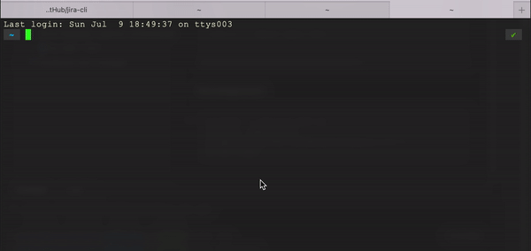
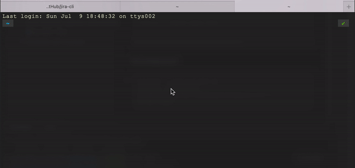
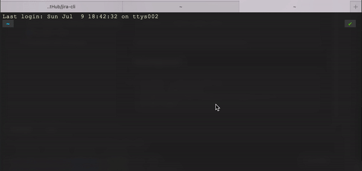

# **JIRA CLI**

### Command Line Interface for Atlassian JIRA

### Features <br />
1. [x] Quick Search <br /> <br />
   
   <br />
2. [x] Advanced Search <br /> <br />
   
   <br />
3. [x] My Issues Search <br /> <br />
   
   <br />

### Installation
```shell
brew tap devashishTaneja/devashishTaneja
brew install devashishTaneja/devashishTaneja/jira

# Link to generate API Key for JIRA
# https://support.atlassian.com/atlassian-account/docs/manage-api-tokens-for-your-atlassian-account/
echo -ne '\nexport JIRA_DOMAIN=https://domain.atlassian.net' >> ~/.zshrc
echo -ne '\nexport JIRA_API_USER=username' >> ~/.zshrc
echo -ne '\nexport JIRA_API_KEY=apikey' >> ~/.zshrc

# Now the fun part, go ahead and start using CLI :)
jira-cli

```

### Development
```shell
go build -o out/jira main.go
out/jira <search_text>
go mod init github.com/devashishTaneja/jira-cli
go mod vendor
```
