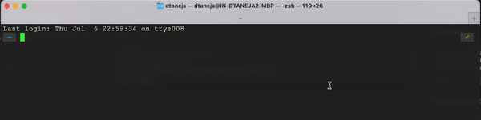

# **JIRA CLI**

### Command Line Interface for Atlassian JIRA



### Features
1. [x] JIRA search
2. [x] JIRA navigation

### Installation
```shell
brew tap devashishTaneja/devashishTaneja
brew install devashishTaneja/devashishTaneja/jira

# Link to generate API Key for JIRA
# https://support.atlassian.com/atlassian-account/docs/manage-api-tokens-for-your-atlassian-account/
echo -ne '\nexport JIRA_DOMAIN=https://domain.atlassian.net' >> ~/.zshrc
echo -ne '\nexport JIRA_API_USER=username' >> ~/.zshrc
echo -ne '\nexport JIRA_API_KEY=apikey' >> ~/.zshrc


jira-cli < search query here :) >

```

### Development
```shell
go build -o out/jira main.go
out/jira <search_text>
go mod init github.com/devashishTaneja/jira-cli
go mod vendor
```
